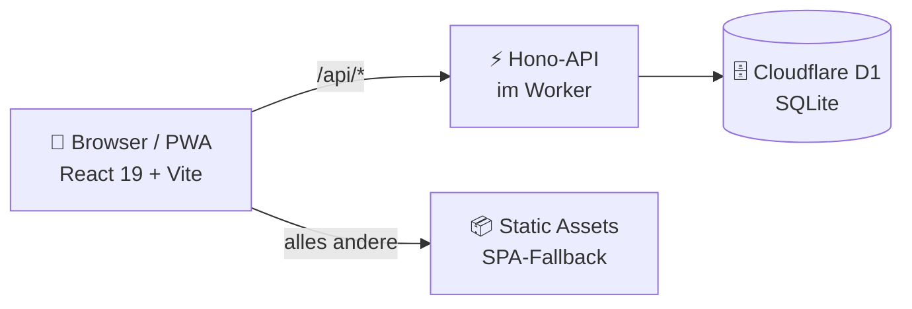

<div align="center">


# 🍻 Getränke-Club

**Die digitale Strichliste für den Jugendclub** — ein Tap pro Getränk, läuft auf jedem Handy, am Tresen-Tablet und im Vorstand-Büro.

[](https://react.dev)
[](https://vite.dev)
[](https://hono.dev)
[](https://workers.cloudflare.com)
[](https://web.dev/progressive-web-apps/)

</div>

---

## ✨ Was die App kann

### 📱 Mitglieder-App
PIN-Login, dann **1 Tap = 1 Strich** auf großen Daumen-Kacheln — mit echten
Strichlisten-Strichen als Zähler. 60-Sekunden-Undo, Tagesübersicht, Monatsstand,
Verlauf nach Tagen, eigene PIN ändern. Im Dezember: 🎉 **Club Wrapped**, der
persönliche Jahresrückblick.

### 🍺 Tresenmodus
Kiosk-Ansicht fürs Tablet am Tresen, ganz ohne Account: Mitglied antippen → PIN →
Kategorie → fertig. Nach 1 Sekunde Bestätigung geht's automatisch zurück zur
Übersicht, nach 15 Sekunden Inaktivität sowieso — nie ein „offener" Account.

### 🛠 Vorstand (Admin-Panel)
| Bereich | Funktion |
|---|---|
| **Strichliste** | Matrix Mitglied × Kategorie, Zeitraumfilter, Drilldown, Striche nachtragen, CSV-Export |
| **Getränke-Log** | Jede Buchung lückenlos nachvollziehbar — Stornieren ✕ und Wiederherstellen jederzeit |
| **Abrechnung** | Jahresansicht mit Kategoriepreisen und €-Summen pro Mitglied, druckfertig |
| **Statistiken** | KPIs, 30-Tage-Trend, Kategorie-Donut, Top-Liste, Wochentag×Stunde-Heatmap |
| **Verwaltung** | Mitglieder (anlegen, PIN-Reset, deaktivieren, endgültig löschen), Kategorien mit Farben & Preisen, Club-Logo, Registrierungs-Code, Audit-Log |

### 📶 Offline-tauglich (PWA)
Fällt das WLAN im Clubraum aus, puffert die Mitglieder-App Buchungen lokal und
reicht sie automatisch nach — idempotent, es entstehen nie Duplikate.

---

## 🏗 Architektur

Ein einziges Cloudflare-Worker-Projekt liefert alles aus — keine Server, keine Kosten im Free Tier:



Details — Datenmodell, alle API-Endpunkte, Sicherheitsmodell, Design-System,
Stolpersteine — stehen im ausführlichen **[Entwickler-Handbuch (docs.md)](docs.md)**.

---

## 🚀 Entwicklung

Voraussetzung: **Node.js ≥ 22**

```bash
npm install
npm run db:migrate:local   # lokale D1-Datenbank anlegen
npm run dev                # Vite-Dev-Server mit Worker + D1, Hot Reload
```

Beim ersten Start landet man automatisch auf `/setup` und legt das erste
Vorstandskonto an.

| Befehl | Zweck |
|---|---|
| `npm run dev` | Entwicklung mit Hot Reload |
| `npm run check` | TypeScript-Check |
| `npm run build` | Production-Build (SPA + Worker) |
| `npm run preview` | Production-Build lokal testen |
| `npm run deploy` | Build + Deploy zu Cloudflare |

## ☁️ Deployment

```bash
npx wrangler d1 create getraenke-club        # 1. D1 anlegen, ID in wrangler.jsonc eintragen
npm run db:migrate:remote                    # 2. Schema auf die echte DB
npx wrangler secret put AUTH_SECRET          # 3. langen Zufallswert setzen
npm run deploy                               # 4. los geht's 🎉
```

Danach die Worker-URL öffnen → Ersteinrichtung → Mitglieder anlegen (oder per
`/signup` selbst registrieren lassen, optional mit Club-Code). Auf dem
Tresen-Tablet `/tresen` öffnen und „Zum Startbildschirm hinzufügen".

## 🔐 Sicherheit in Kürze

Alle nutzen 4-stellige PINs (gehasht + gesalzen, schwache PINs wie `1234` werden
abgelehnt). Da der PIN-Raum klein ist, schützt **Rate-Limiting**: 5 Fehlversuche →
5 Minuten Sperre. Jede Admin-Aktion landet im Audit-Log, Buchungen werden nie hart
gelöscht (Soft-Delete), Mitglieder-Historie bleibt auch nach Konto-Löschung erhalten.

## 📜 Historie

- **`v2`** (aktuell) — kompletter Neuaufbau: React SPA + Hono auf Cloudflare Workers/D1
- **`v1`** — die ursprüngliche Next.js-Version, als Git-Tag konserviert (`git diff v1 v2` funktioniert)
